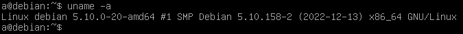
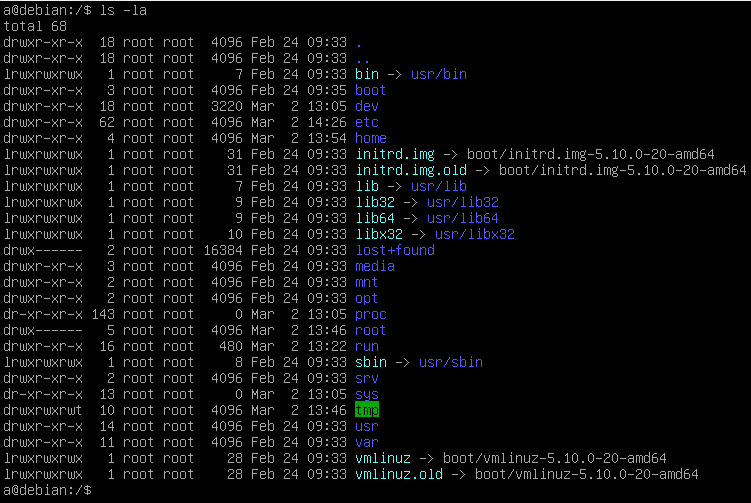
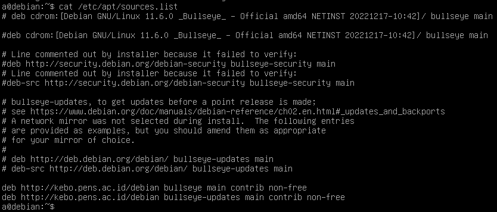

# Minggu 2
## A. Kernel

Kernel adalah inti dari jalannya sebuah sistem komputer dan berfungsi untuk mengatur hubungan antara hardware dengan operasi sistem. Kernel menggunakan sistem keturunan dalam menghasilkan semua versi yang ada sekarang. Beberapa kernel yang cukup terkenal adalah unix, linux, solaris, bsd, dan ms-dos. Linux, Solaris, dan bsd merupakan turunan dari kernel unix. Maka dari itu kernel tersebut sering disebut unix-like (seperti unix). Untuk linux sendiri saat ini sudah memiliki versi 6 dalam perkembangannya, dan pada gambar berikut merupakan versi kernel dari debian 11 saat ini.

## B. Directory Structure

Struktur direktori dalam sebuah sistem operasi dipengaruhi oleh jenis kernel tersebut. Untuk semua keturunan dari unix memiliki struktur yang hampir sama. Untuk debian 11 memiliki kernel linux dan berikut adalah struktur direktorinya.

1. /bin

    Direktori ini digunakan untuk menyimpan seluruh executable file pada sistem operasi. Executable ini mengacu pada package yang dapat dijalankan pada sistem operasi.

2. /boot

    Pada direktori ini, kita dapat mengkonfigurasi partisi boot yang ada pada sistem operasi kita. Keseluruhan konfigurasi boot sebelum kita masuk ke operasi sistem kita dapat dikonfigurasi pada partisi ini.

3. /dev

    Direktori ini berisi daftar seluruh hardware yang terhubung dengan komputer kita. Hardware tersebut dapat ter-daftar karena kernel yang mengenali hardware tersebut.

4. /etc

    Direktori /etc memiliki fungsi untuk menyimpan konfigurasi seluruh package yang terinstall pada sistem operasi kita. Pada sistem operasi berbasis kernel linux, file package disimpan terpisah dengan file konfigurasi. Jadi seluruh file dapat tersimpan dengan ter-struktur.

5. /home

    Diretori Home merupakan direktori utama dari seluruh user yang ada pada linux. Direktori ini digunakan untuk menyimpan keseluruhan file dan konfigurasi yang dimiliki oleh user.

6. /opt

    Opt atau optional merupakan direktori yang digunakan untuk menyimpan package tambahan yang bukan merupakan bawaan dari sistem operasi. Seperti package tambahan yang diinstall dengan melakukan compile manual terhadap source code.

7. /proc

    Direktori proc berfungsi untuk menyimpan informasi hardware yang merupakan bagian dari sistem inti dari hardware, seperti informasi tentang memori, cpu, dan swap.

8. /root

    Direktori ini sering menjadi kebingungan oleh seseorang yang baru saja menggunakan linux. Karena pada instalasi awal ditunjukkan struktur direktori ada / (root) dan /root. / tetap disebut dengan direktori root, namun untuk /root merupakan direktori user root. Jadi seluruh file konfigurasi unuk user root terletak pada direktori ini. Tidak hanya direktori, melainkan file pribadi dari user root juga disimpan pada direktori ini karena direktori utama user root tidak terletak pada /home

9. /run

    Direktori ini merupakan pecahan dari direktori /tmp. Direktori ini berisi informasi tentang status dari sebuah aplikasi yang berjalan. Direktori ini disimpan terpisah dengan /tmp karena /tmp bersifat sementara dan akan terhapus setelah sistem operasi direstart. Sedangkan informasi tentang status aplikasi harus tetap bisa diakses meskipun sistem operasi telah mengalami reboot.

10. /tmp

    Direktori tmp sesuai dengan kepanjangannya adalah temporary, digunakan untuk menyimpan file yang bersifat sementara dan dibutuhkan hanya ketika sistem tersebut berjalan. Ketika sistem operasi tersebut di-restart, maka semua file pada direktori tersebut akan hilang.

11. /usr

    usr merupakan direktori untuk menyimpan semua package pada sistem operasi. Disini berbeda dengan /etc karena etc bertugas untuk menyimpan konfigurasi saja.

## C. Perbedaan su dan sudo

su dan sudo merupakan dua hal yang berbeda. su adalah kepanjangan dari "substitute user" yang memiliki definisi perpindahan user. Dari definisi tersebut dapat disimpulkan bahwa su digunakan untuk berpindah ke user yang kita tuju. Parameter yang digunakan sebenarnya cukup banyak, namun yang sering digunakan adalah "-". Parameter tersebut merupakan parameter untuk menunjuk user. misal, ketika kita menggunakan perintah "su - user1" , maka kita akan langsung diarahkan ke user1 langsung dengan home directory user tersebut. Jika kita menggunakan parameter tersebut tanpa user yang dituju, maka secara otomatis akan menunjuk user root sebagai tujuannya. 

Sedangkan untuk sudo, merupakan perintah yang digunakan untuk meng eksekusi perintah yang berada dalam satu baris sebagai super user. Jadi meskipun kita tidak masuk sebagai super user, kita tetap bisa mendapatkan privilege sebagai super user.

## D. Jenis Repository

Sebelum kita membahas tentang jenis repository, kita harus mengenal terlebih dahulu apa itu repository.
Repository merupakan sebuah server yang digunakan untuk menyimpan kumpulan package. Kenapa tidak disebut dengan penyimpanan drive online saja? karena repository dikhususkan untuk menyimpan berkas dalam bentuk kode yang amat banyak. Dibutuhkan protokol tertentu untuk melakukan transfer data agar file yang dikirim tidak hilang sebagian di tengah jalan.

Sekarang kita akan fokus terhadap repository package dari sistem operasi debian. Debian menggunakan package manager "apt". Package manager tersebut digunakan untuk men-download, meng-install, serta meng-hapus package dari sistem operasi debian.

Jenis-jenis dari repository debian dapat kita lihat pada detail repository di /etc/apt/sources.list

Pada salah satu baris yang tidak ter-disable, kita bisa melihat isiannya adalah 

    deb http://kebo.pens.ac.id/debian bullseye main contrib non-free

rincian pada baris tersebut adalah

deb = jenis package yang akan diambil adalah deb

http://kebo.pens.ac.id/debian = tujuan server yang akan dijadikan tempat download package nya

bullseye = Tipe repository yang akan diambil. Pada opsi ini ada beberapa tipe yaitu bullseye yang berisi package utama, bullseye-updates yang berisi package update bullseye-security untuk package security dari sistem operasi, serta bullseye-backport yang berisi package beta. 

main contrib non-free = Keterangan tersebut adalah identifikasi package yang termasuk dalam kategori package utama, package hasil kontribusi komunitas, atau package yang sifatnya non-oss (closed source).

## E. APT Command

Berhubungan dengan bab sebelumnya yang membahas repository, kali ini kita akan membahas command yang menggunakan repository tadi yaitu Package Managernya. Debian menggunakan APT (Advance Package Tool) sebagai default package managernya. Fungsi utama dari package manager yaitu menginstall dan menghapus package pada suatu repository. Namun saat ini package manager berkembang tidak hanya sebagai installer, namun bisa digunakan sebagai monitor package yang ada di sebuah operasi sistem. Kita bisa melihat apa saja package yang sudah terinstall dalam sebuah operasi sistem, apa saja package baru yang ada di repository, dll.

Untuk itu melakukan hal tersebut, maka kita perlu memahami apa saja perintah yang umum digunakan dengan APT.

1. apt install < nama package >

    Perintah tersebut digunakan untuk menginstall sebuah package baru. Apabila kita sudah memiliki package tersebut karena sebelumnya sudah pernah mendownload, maka secara otomatis package yang sudah terdownload akan dipakai. Namun jika kita belum pernah mendownload package tesebut, maka apt akan langsung mendownload dari server repository yang kita miliki.

2. apt remove < name package >

    Perintah ini digunakan untuk menghapus package yang terinstall pada pc kita.

3. apt purge < nama package >

    Perintah ini juga digunakan untuk menghapus package yang ada di pc kita. Namun perintah ini memiliki perbedaan dengan apt remove yaitu dengan menggunakan apt purge, maka file konfigurasi yang berhubungan dengan package tersebut akan ikut terhapus. File konfigurasi tersebut ada di /etc dan secara otomatis ketika kita menginstall package tersebut, maka konfigurasi akan dibuat baru. Berbeda dengan kondisi ketika kita menghapus menggunakan apt remove, file konfigurasi akan tetap ada dan package kita yang sebelumnya sudah kita hapus dan install kembali akan memiliki konfigurasi yang sama seperti sebelum kita menghapusnya.

4. apt list

    Perintah ini digunakan untuk menampilkan semua package yang terindeks oleh package manager kita. Semua package tersebut baik yang sudah terinstall maupun yang belum. Jadi kita bisa melakukan pengecekan terhadap apa saja package yang sudah terinstall pada pc kita.

5. apt search < nama package >

    Jika sebelumnya kita menggunakan apt list untuk menampilkan package yang ter-indeks, maka perintah ini digunakan untuk mencari package tertentu. Dengan menggunakan perintah ini, maka kita bisa fokus ke package yang kita cari. Informasi yang ditampilkan pada perintah untuk juga cukup spesifik dengan deskripsi dari package tersebut.

6. apt update

    Perintah ini merupakan perintah yang berhubungan langsung dengan repository. Perintah ini digunakan untuk meng-update indeks dari sebuah repository. Jadi apabila ada update suatu package, notifikasinya bisa masuk ke pc kita.

7. apt upgrade

    Berbeda dengan perintah sebelumnya. Perintah ini digunakan untuk melakukan upgrade package yang ada update versinya. Namun perintah ini tidak melakukan update terhadap indeks repository yang ada di lokal kita. Jadi sebelum melakukan upgrade, maka pastikan sudah meng-update indeksnya menggunakan apt update.

8. apt dist-upgrade

    perintah ini juga berbeda dengana perintah sebelumnya. Perintah ini kita gunakan apabila terjadi major update pada sistem operasi kita. Jadi semua kebutuhan update dari sistem operasi kita dapat langsung melakukan update.

9. apt autoremove

    Semua package yang terinstall pada sistem kita tidak selamanya akan digunakan. Karena pada kasus tertentu, ada beberapa aplikasi yang memiliki dependency dengan package lain. Ketika ketergantungan tersebut sudah tidak ada, maka package yang tadi sudah terinstall tidak akan digunakan. Maka dari itu ada parameter tambahan yaitu autoremove untuk menghapus semua package yang tidak digunakan atau tidak memiliki ketergantungan dengan package yang lain.