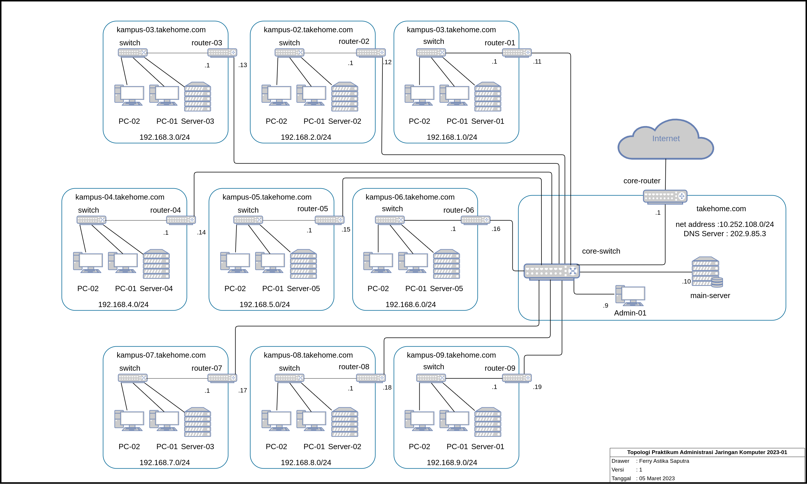

# Minggu 3

Pada minggu ketiga ini, pembelajaran diarahkan pada praktik terhadap real project dari sebuah administrasi jaringan. Topologi yang digunakan adalah sebagai berikut.



Masing-masing kelompok memiliki server dan router. Alokasi IP pada masing-masing kelompok juga berbeda. Pada router gateway utama, terdapat dns server yang sudah dikonfigurasi untuk menjadi sebuah recursive server yang melakukan query ke dns server selanjutnya. 

Kelompok kami adalah kelompok 5 yang terdiri dari :

|No|Nama|NRP|
|-|-|-|
|1|Krisna Wahyu Setyawan|3120600002|
|2|Ahmad Musafir Khoirul Fattah|3121600003|
|3|Irawan Dwiarno Pangestu|3121600020|

Tiap minggu ada terdapat backlog yang harus dikerjakan dalam memenuhi target utama Workshop Administrasi Jaringan.
### Backlog Minggu Ketiga

- [Konfigurasi Router](#konfigurasi-router)
  - [Reset Router](#reset-router)
  - [Konfigurasi](#konfigurasi)
    - [IP Public](#ip-public)
    - [IP Local](#ip-local)
    - [Default Route](#default-route)
    - [Route to Other Network on local](#route-to-other-network-on-local)
    - [DNS](#dns)
    - [Internet Client](#internet-client)
    - [Dan berikut konfigurasi lengkapnya](#dan-berikut-konfigurasi-lengkapnya)

<br><br>

# Konfigurasi Router

## Reset Router

Pertama adalah me-_reset_ router agar konfigurasi pada router dikembalikan ke konfigurasi pabrik. Untuk reset router, bisa menggunakan perintah dibawah pada **Terminal** winbox

```console
/system
reset-configuration no-defaults=yes skip-backup=yes
```

atau pada tampilan Winbox adalah sebagai berikut


## Konfigurasi

### IP Public

Untuk menambah _config_ untuk IP public, kita bisa menggunakan perintah berikut untuk mengatur port `ether1` untuk _public_ . Sesuai dengan topologi diatas, maka IP _Public_ yang akan kita gunakan pada router kita adalah 10.252.108.15/24
aaaaaa
```console
/ip address
add address=10.252.108.15/24 interface=ether1 network=10.252.108.0
```

### IP Local

Untuk menambah _config_ untuk IP lokal, kita bisa menggunakan perintah berikut untuk mengatur port `ether2` untuk lokal . Sesuai dengan topologi diatas juga, untuk IP Local yang akan kita gunakan adalah 192.168.5.1/24 yang merupakan bagian dari _network_ 192.168.5.0/24

```console
/ip address
add address=192.168.5.1/24 interface=ether2 network=192.168.5.0
```
Hasil Konfigurasi dari IP Public dan IP Local adalah sebagai berikut


### Default Route

Untuk default route, atur menggunakan perintah. Default route kita gunakan untuk mengalirkan semua paket yang menuju internet, karena pada dasarnya tabel routing kita belum mencakup semua ip yang ada. Jadi keberadaan _default route_ sangat penting untuk membantu paket menuju ke _node_ tujuan.

```console
/ip route
add gateway=10.252.108.212
```
### Route to Other Network on local

Untuk routing ini, atur menggunakan perintah. Sesuai dengan namanya, routing ini kita gunakan untuk mendeklarasikan rute ke network yang sudah kita ketahui di jaringan lokal. Jaringan lokal yang kita maksud disini adalah network yang dimiliki oleh kelompok lain. Jadi semua kelompok dapat melakukan koneksi satu sama lain.

```console
/ip route
add gateway=10.252.108.12 network=192.168.2.0/24
add gateway=10.252.108.13 network=192.168.3.0/24
add gateway=10.252.108.14 network=192.168.4.0/24
add gateway=10.252.108.16 network=192.168.6.0/24
add gateway=10.252.108.17 network=192.168.7.0/24
add gateway=10.252.108.18 network=192.168.8.0/24
```

Hasil dari konfigurasi diatas adalah sebagai berikut


### DNS

Gunakan perintah dibawah untuk mengatur DNS pada router. DNS ini digunakan untuk mendeklarasikan dns server tujuan dari network kita. Nantinya kita tinggal mendeklarasikan dns server ke client kita dengan menggunakan ip dari router kita. Maka secara otomatis _aaaaa_ dns dari router kita akan di-_forward_ ke dns yang sudah kita tambahkan.

```console
/ip dns
set servers=202.9.85.3
```
Berikut adalah hasil konfigurasi dns pada mikrotik


### Internet Client

Untuk _config client_, config yang diterapkan hanya DHCP server karena hal yang belum dikonfigurasi pada _client_ hanya tinggal IP nya saja menggunakan perintah

```console
/ip pool
add name=dhcp_pool0 ranges=192.168.5.2-192.168.5.254
/ip dhcp-server network
add address=192.168.5.0/24 gateway=192.168.5.1
/ip dhcp-server
add address-pool=dhcp_pool0 disabled=no interface=ether2 name=dhcp1
```

<br><br>

### Dan berikut konfigurasi lengkapnya

```console
# mar/10/2023 07:46:55 by RouterOS 6.39.3
# software id = SSDE-WU5D
#
/interface wireless security-profiles
set [ find default=yes ] supplicant-identity=MikroTik
/ip pool
add name=dhcp_pool0 ranges=192.168.5.2-192.168.5.254
/ip dhcp-server
add address-pool=dhcp_pool0 disabled=no interface=ether2 name=dhcp1
/ip address
add address=10.252.108.15/24 interface=ether1 network=10.252.108.0
add address=192.168.5.1/24 interface=ether2 network=192.168.5.0
/ip dhcp-server network
add address=192.168.5.0/24 gateway=192.168.5.1
/ip dns
set servers=202.9.85.3
/ip firewall nat
add action=masquerade chain=srcnat out-interface=ether1
/ip route
add gateway=10.252.108.212
add gateway=10.252.108.12 network=192.168.2.0/24
add gateway=10.252.108.13 network=192.168.3.0/24
add gateway=10.252.108.14 network=192.168.4.0/24
add gateway=10.252.108.16 network=192.168.6.0/24
add gateway=10.252.108.17 network=192.168.7.0/24
add gateway=10.252.108.18 network=192.168.8.0/24
/system identity
set name=Kel-5
```

[def]: #backlog-minggu-ketiga