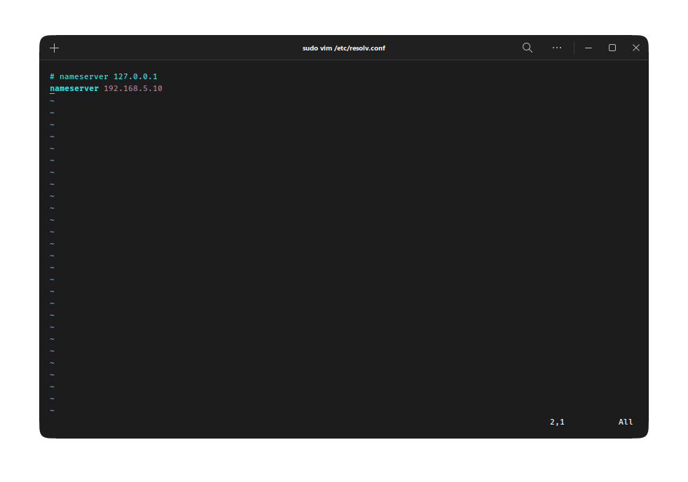
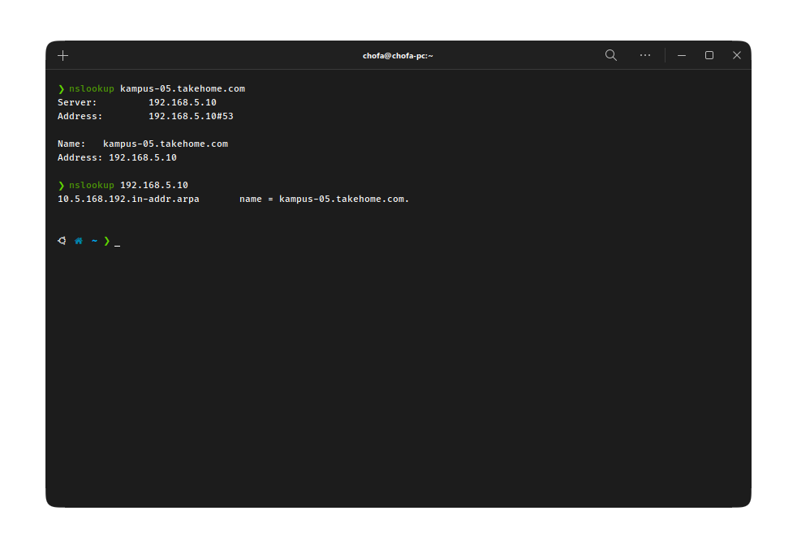

# Minggu 5
Pada minggu ke-lima ini, kita akan memahami cara kerja dns serta meng-implementasikan sebuah DNS Server pada server lokal kita.

### Backlog Minggu 5

- [Percobaan DNS pada Client](#percobaan-dns-pada-client)

 

# Percobaan DNS pada Client

Untuk melakukan percobaan konfigurasi server DNS kita pada _client_, pastikan client dapat melakukan _nslookup_. Konfigurasikan dns server komputer _client_ menuju server DNS kita.

Client yang akan kita gunakan pada percobaan ini adalah linux, maka untuk konfigurasi server DNS nya ada pada file /etc/resolv.conf .

Setelah itu mari kita lakukan nslookup terhadap domain serta reverse ip nya.

[def]: #daftar-isi